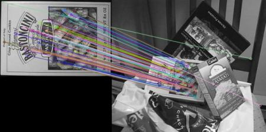

<div align="center">
  <h1> Augmented Reality using openCV-python</h1>
  
 </div>

> This project uses openCV for showcasing the use if openCV-pyhton in Augmented Reality.


# 💾 REQUIREMENTS
+ opencv-python
+ numpy

```bash
pip install -r requirements.txt
```
# License 📜

This project is available under the MIT license. See the [LICENSE.md](https://github.com/pratham-bhatnagar/AR-openCV/blob/master/LICENSE.md) file for more info.

### ORB in OpenCV
ORB (oriented BRIEF) keypoint detector and descriptor extractor.

The algorithm uses FAST in pyramids to detect stable keypoints, selects the strongest features using FAST or Harris response, finds their orientation using first-order moments and computes the descriptors using BRIEF (where the coordinates of random point pairs (or k-tuples) are rotated according to the measured orientation).

> Source: [ORB openCV](https://docs.opencv.org/3.4/db/d95/classcv_1_1ORB.html)

### Brute-Force Feature Matching
Brute-Force matcher is simple. It takes the descriptor of one feature in first set and is matched with all other features in second set using some distance calculation. And the closest one is returned.

For BF matcher, first we have to create the BFMatcher object using `cv2.BFMatcher()`. It takes two optional params. First one is `normType`. It specifies the distance measurement to be used. By default, it is `cv2.NORM_L2`. It is good for SIFT, SURF etc (`cv2.NORM_L1` is also there). For binary string based descriptors like ORB, BRIEF, BRISK etc, `cv2.NORM_HAMMING` should be used, which used Hamming distance as measurement. If ORB is using `VTA_K == 3 or 4`, `cv2.NORM_HAMMING2` should be used.
<div align="center">

  
 </div>

> Source: [Brute-Force Feature Matching](https://opencv24-python-tutorials.readthedocs.io/en/latest/py_tutorials/py_feature2d/py_matcher/py_matcher.html)

<div align="center">

<table>
<tr>
    <td>
       <h3>Key Points Matching</h3>
       
</td>
</tr>

<tr>
    <td>
        
    </td>
</tr> 

<tr>
    <td>
       <h3>PolyLines Drawing</h3>
    </td>
</tr>

<tr>
    <td>
        
    </td>
</tr> 

<tr>
    <td>
       <h3>Mask Creation on Detected Homography</h3>
    </td>
</tr>

<tr>
    <td>
        
    </td>
</tr> 

</table>


</div>


## 📝 CODE EXPLANATION

Importing openCV and Numpy
```py
import  numpy as np
import cv2
```
***
Setting a Standard size for Input Images
```py
stdShape = (275,440)
```
***
Taking Webcam and Image Input
```py
webCam = cv2.VideoCapture(0)
imgTarget = cv2.imread("assets\imgTarget.jpg")
imgTarget = cv2.resize(imgTarget,stdShape)
displayVid = cv2.VideoCapture("assets\displayVid.mp4")
```
***
Creating a ORB descriptor for Feature Detection
```py
ORB = cv2.ORB_create(nfeatures=1000)
```
***
Identifying features using `ORB.detectAndCompute` Method.
```py
keyPoint1, descriptor1 = ORB.detectAndCompute(imgTarget,None)
```
***
Drawing Features on the Target Image 
```py
imgTarget=cv2.drawKeypoints(imgTarget, keyPoint1,None) 
cv2.imshow("keypoints",imgTarget)
```
***
Initializing a conditional loop, Checking for Webcam input, And then using `ORB.detectAndCompute` method for spotting features in the webcam.
```py
while webCam.isOpened():
    _ , imgWebcam = webCam.read()  
    keyPoint2, descriptor2 = ORB.detectAndCompute(imgWebcam,None) 
    
    imgAR  = imgWebcam.copy()
    
    _ , imgVideo = displayVid.read()
    imgVideo = cv2.resize(imgVideo, stdShape)
```
***
Using Brute-Force Feature Matching for Comparing Target Image and Webcam features.
```py
    bruteForce = cv2.BFMatcher()
    matches = bruteForce.knnMatch(descriptor1,descriptor2,k=2)
    ```
***
Filtering out good matches only 
```py
    goodMatches = []
    for m,n in matches:
        if m.distance < 0.75 * n.distance:
            goodMatches.append(m)
```
***
Converting `goodMatches` into openCV accepted Coordinates
```py                 
    if len(goodMatches) > 15:
        srcPts = np.float32([keyPoint1[m.queryIdx].pt for m in goodMatches]).reshape(-1,1,2)
        dstPts = np.float32([keyPoint2[m.trainIdx].pt for m in goodMatches]).reshape(-1,1,2)
```
***
Using `cv2.findHomography` method to find to corners using `cv2.RANSAC` algorithm
```py
        matrix , mask = cv2.findHomography(srcPts,dstPts,cv2.RANSAC,5)
```
***
Using `cv2.perspectiveTransform` method to convert corners matrix into Standard shape
```py  
        pts = np.float32([[0,0],[0,440],[275,440],[275,0]]).reshape(-1,1,2)
        dst = cv2.perspectiveTransform(pts,matrix)
```
***
Using `cv2.polylines` to show the Homography
```py
        cv2.polylines(imgWebcam,[np.int32(dst)],True,(0,0,255),3)
```
***
Warping Display Video into Detected Homography
```py       
        imgWarp = cv2.warpPerspective(imgVideo,matrix,(imgWebcam.shape[1],imgWebcam.shape[0]))
```  
***
Filling the Detected Homography with Black mask
```py      
        newmask = np.zeros((imgWebcam.shape[0],imgWebcam.shape[1]),np.uint8)
        cv2.fillPoly(newmask,[np.int32(dst)],(255,255,255))
```
***
Intersecting Mask Image with  Target Image
```py      
        invMask = cv2.bitwise_not(newmask)
        imgAR = cv2.bitwise_and(imgAR,imgAR,mask=invMask)
        imgAR = cv2.bitwise_or(imgAR,imgWarp)
```
***
Finally Displaying Output   
```py
    cv2.imshow("imgAR",imgAR)
    
    if cv2.waitKey(1) & 0xFF == ord('q'):
          break

webCam.release()
```
***

<div align = "center">
<h2>📬 Contact</h2>

If you want to contact me, you can reach me through below handles.

<a href="https://twitter.com/prrthamm">@prrthamm</img></a>&nbsp;&nbsp; <a href="https://www.linkedin.com/in/pratham-bhatnagar/"> Pratham Bhatnagar</img></a>

</div>